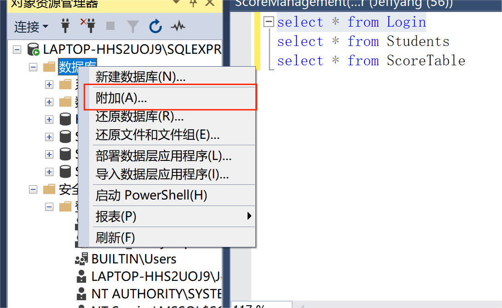
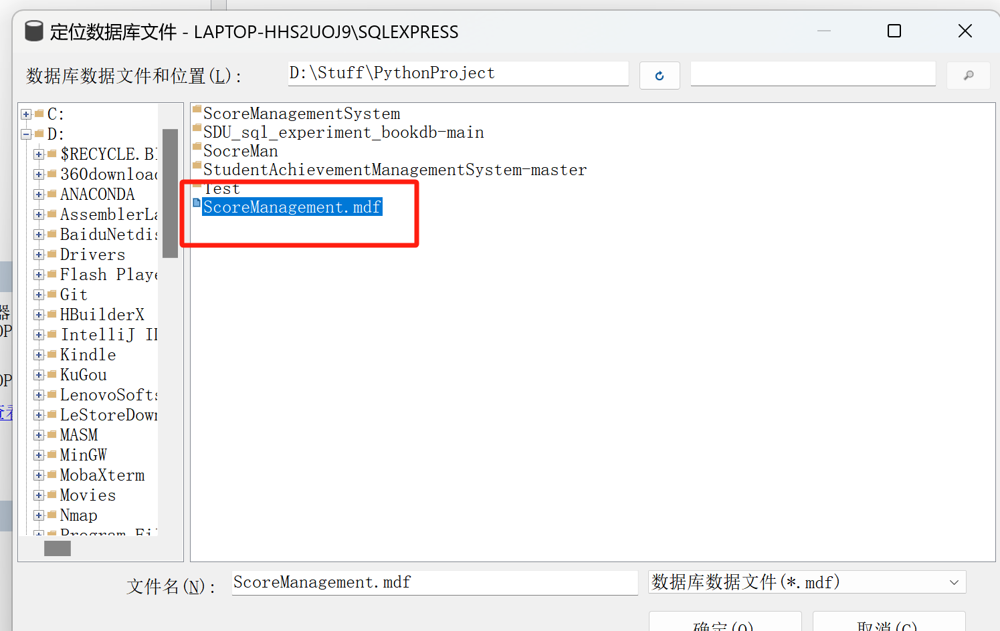
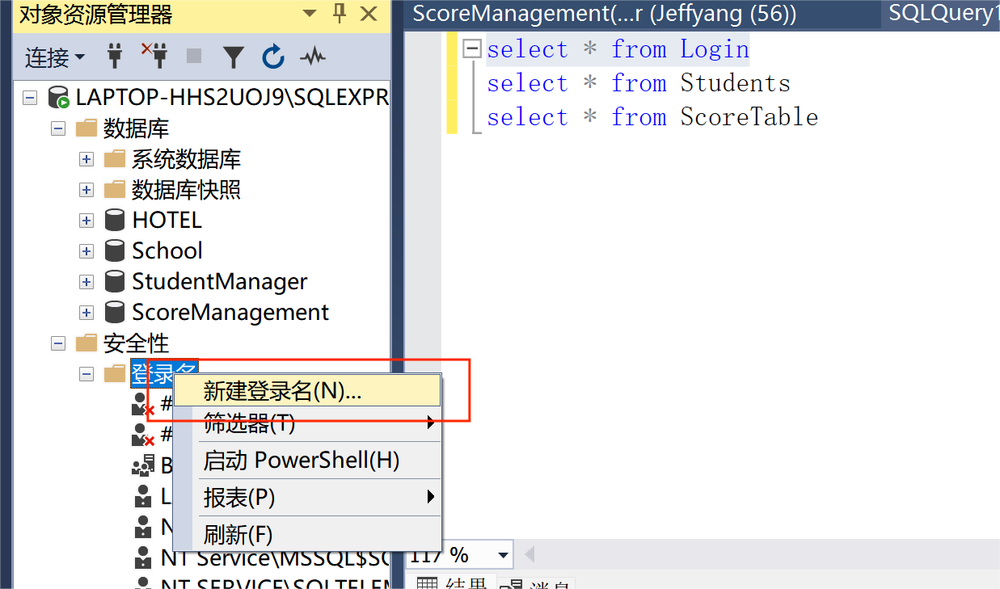
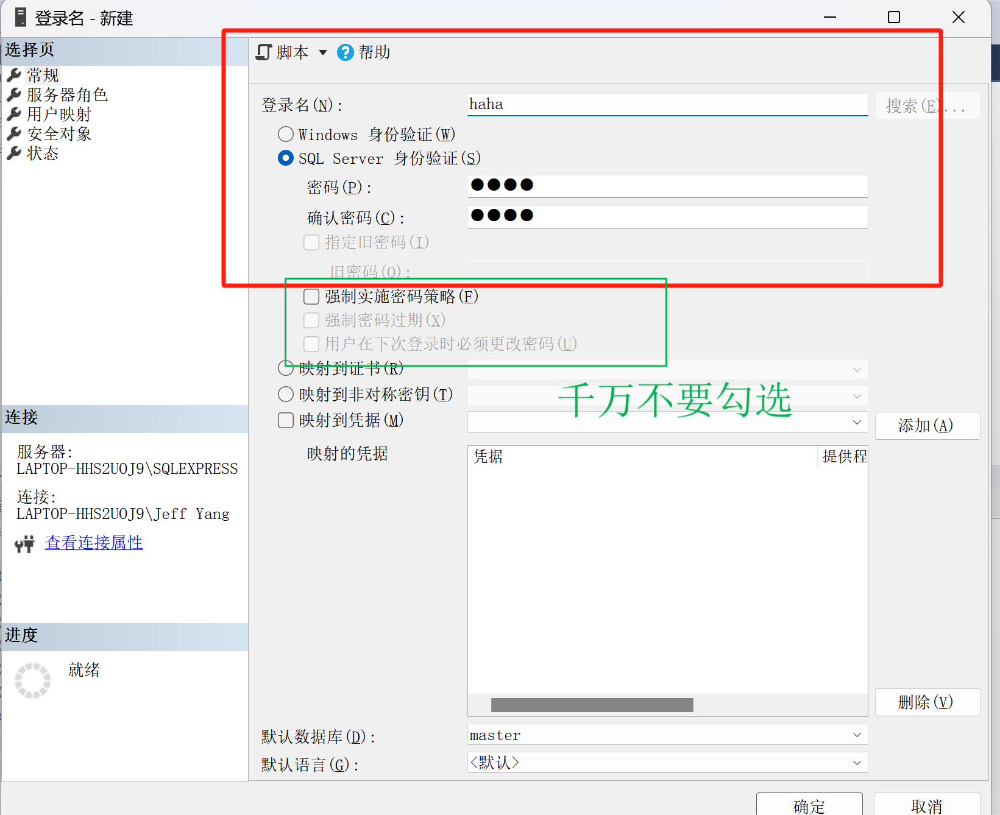
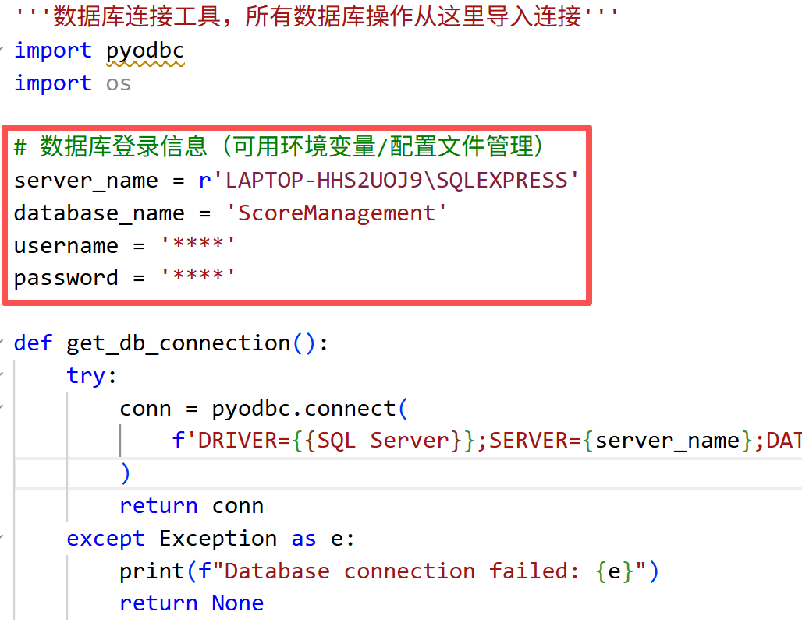
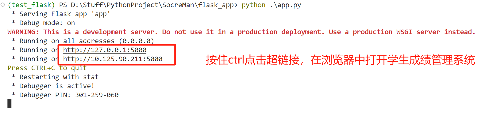

# 学生成绩管理系统

## 一、系统设计需求

本学生成绩管理系统主要为学生成绩的查询与维护提供便捷，打造一个方便管理和信息查阅的网络平台。  
- **学生** 可以通过系统查阅个人信息（所在系、班级、所选课程、成绩等）。
- **教师** 可以查阅学生信息、教师自身信息，并对所执教课程的学生成绩进行录入与管理。
- **系统管理员** 不仅可以实现上述所有功能，还可对学生信息、教师信息、课程信息进行添加、删除、修改，并能管理普通用户（学生/教师）的登录权限（如禁用某些账户登录系统）。

## 二、系统设计思路

- 本系统后端数据库采用 **SQL Server**，通过 **pyodbc** 库与 Python 后端连接。
- 系统具有多用户特性，采用 **Flask** 框架搭建 Web 服务器，向用户提供互联网访问入口。
- 用户可使用移动终端随时随地访问系统，无需固定设备。
- 前端网页 UI 通过 Flask 的路由函数与后端业务逻辑连接。
- 业务逻辑层通过设计好的 SQL 存储过程、触发器和函数操作数据库，保证数据安全与一致性。
- 本项目主要聚焦于数据库设计、用户界面交互设计以及系统基本功能（用户登录、信息查询、增删改等）。
- **注意**：本项目为课程项目，不涉及网络平台公网部署与多用户高并发技术实现，这部分不属于本课程重点，固相应功能并未实现。
**更多系统设计细节参考/Documentation目录下的两个说明文档**

## 三、系统结构与模块说明

```
flask_app/
│
├── app.py                   # 主入口，注册各蓝图
├── db_utils.py              # 数据库连接工具,所有与数据库相关的操作都通过这里获取连接
├── requirements.txt         # 依赖包列表
├── README.md                # 项目说明文档
│
├── routes/                  # 路由与视图函数目录
│   ├── common.py            # 通用功能（登录、登出、修改密码等）
│   ├── student.py           # 学生专属功能（查成绩、查个人信息等）
│   ├── teacher.py           # 教师专属功能（查课程、录成绩等）
│   └── admin.py             # 管理员专属功能（学生/教师/课程管理等）
│
├── ScoreManagement(final2.0).sql    # 文件包含了所有基本表、触发器、存储过程和函数
│
├── ScoreManagement_log.ldf & ScoreManagement.mdf    # 数据库的导出文件
│
├── templates/               # 前端模板（HTML）   
│
└── static/                  # 静态文件（CSS/JS/图片等）
```
注：由于sql server无法在命令行中运行ScoreManagement(final2.0).sql文件创建数据库，因此我将建立好的数据库导出，使用者可以直接将mdf文件导入sql server中

## 四、环境搭建与运行说明

### 1. 软件环境

- Python >= 3.8
- SQL Server 2022（需提前部署好并导入数据表、存储过程等）
- 推荐使用Windows系统装载SQL Server 2022数据库

### 2. Python 环境配置

请先创建并激活虚拟环境，然后安装依赖：

```bash
pip install -r requirements.txt
```
### 3. 数据库配置

1. **以管理员身份启动 SQL Server Management Studio**。

2. **导入数据库**  
<p align="center">
  <span style="font-size:10px; font-weight:normal;">导入数据库</span><br>
  
</p>

<p align="center">
  <span style="font-size:10px; font-weight:normal;">添加mdf文件</span><br>
  
</p>

3. **创建数据库用户**  
<p align="center">
  <span style="font-size:10px; font-weight:normal;">新建登录名</span><br>
  
</p>
<p align="center">
  <span style="font-size:10px; font-weight:normal;">设置登录名和密码，注意不能勾选图中的绿框</span><br>
  
</p>


4. **在源代码 `flask_app/db_utils.py` 中填写数据库信息**  
   - 打开 `flask_app/db_utils.py` 文件。
   - 填入你的数据库服务器名、数据库名（固定为 `ScoreManagement`），以及刚刚设置的用户名和密码。
<p align="center">
  <span style="font-size:10px; font-weight:normal;">连接数据库</span><br>
  
</p>


### 4. 运行程序
在终端中输入：
```
cd flask_app
python app.py
```
<p align="center">
  <span style="font-size:10px; font-weight:normal;">运行系统</span><br>
  
</p>

## 注
本仓库为厦门大学信息学院本科生课程“数据库数据系统原理”的课程项目。
项目主要聚焦于数据库的学习，因此一些设计的网页功能并未实现，仅作参考。
同时，为了迎合课程实验课的所使用数据库系统，本项目沿用了SQL Server作为数据库，其配置和使用上没有MySQL简便，敬请谅解。