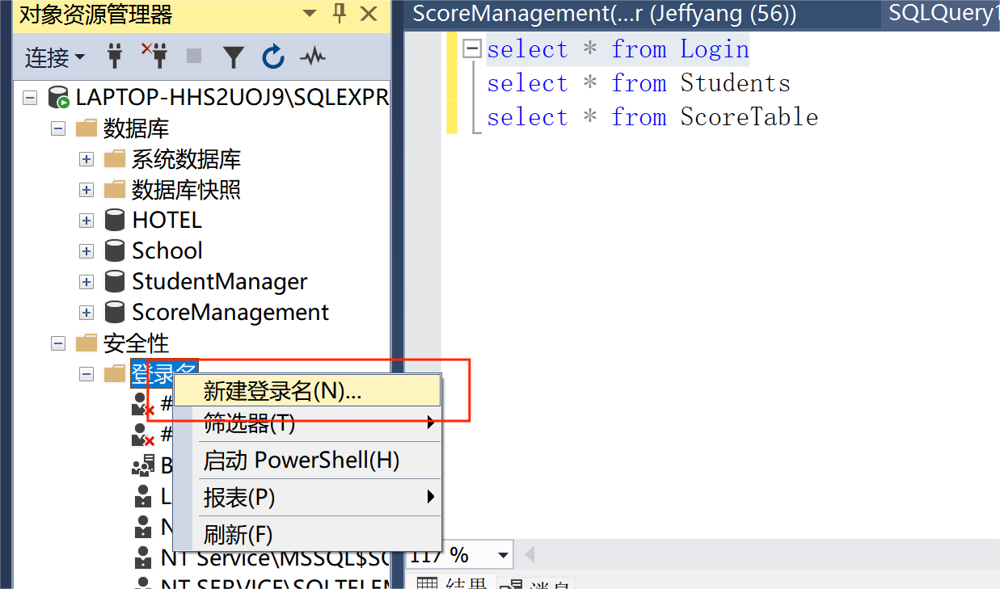
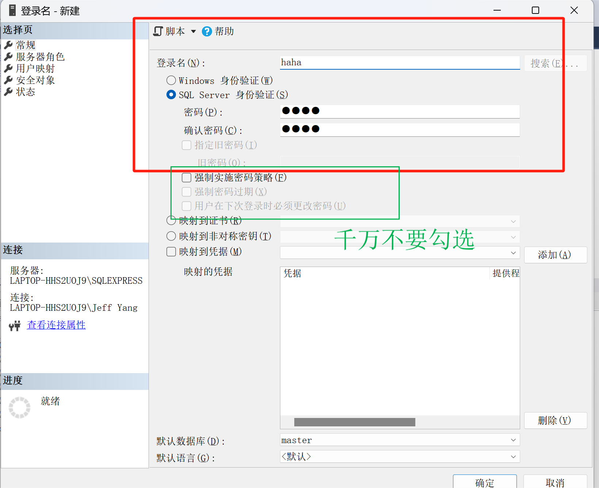
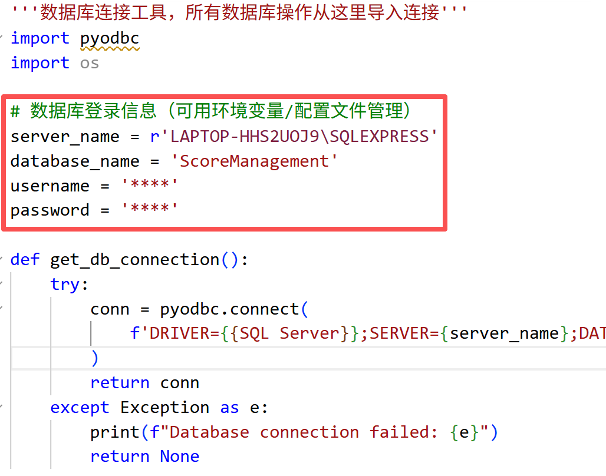
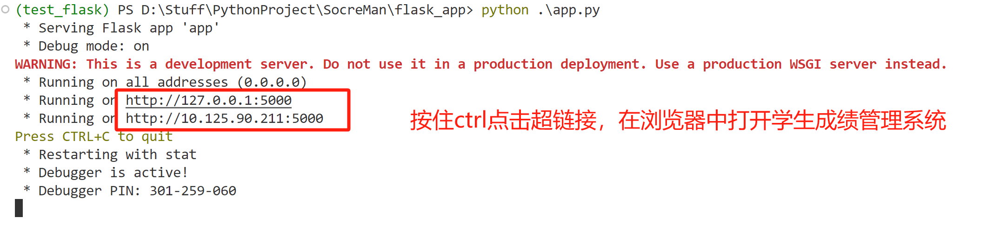

# Student Score Management System

## 1. System Design Requirements

This Student Score Management System is designed to provide a convenient platform for querying and maintaining student grades, making it easy to manage and view information online.  
- **Students** can view their personal information (department, class, enrolled courses, grades, etc.) through the system.
- **Teachers** can view student information, their own information, and enter or manage grades for the courses they teach.
- **System administrators** can not only access all the above functions, but also add, delete, and modify student, teacher, and course information. They can also manage the login permissions of regular users (students/teachers), such as disabling accounts.

## 2. System Design Overview

- The system backend uses **SQL Server** as the database, connected to the Python backend via the **pyodbc** library.
- It supports multiple users and is built using the **Flask** framework to provide web access.
- Users can access the system anytime, anywhere via mobile devices, without being limited to specific hardware.
- The frontend webpages (UI) are connected to backend business logic through Flask routing functions.
- The business logic layer operates the database via well-designed SQL stored procedures, triggers, and functions to ensure data security and consistency.
- This project focuses on database design, user interface interaction, and core system features (user login, information query, create/read/update/delete, etc.).
- **Note:** This project is for course use only and does not involve public network deployment or high-concurrency technology, which are outside the course scope and thus not implemented.
**More system design details can be found in the two documentation files under the /Documentation directory.**
## 3. System Structure & Module Description

```
flask_app/
│
├── app.py                   # Main entry, registers blueprints
├── db_utils.py              # Database connection utilities, all DB operations go through here
├── requirements.txt         # Dependency list
├── README.md                # Project documentation
│
├── routes/                  # Routes and view functions
│   ├── common.py            # Common features (login, logout, password change, etc.)
│   ├── student.py           # Student features (view grades, personal info, etc.)
│   ├── teacher.py           # Teacher features (view courses, enter grades, etc.)
│   └── admin.py             # Admin features (manage students/teachers/courses, etc.)
│
├── ScoreManagement(final2.0).sql    # Contains all basic tables, triggers, stored procedures, and functions
│
├── ScoreManagement_log.ldf & ScoreManagement.mdf    # Database export files
│
├── templates/               # Frontend templates (HTML)
│
└── static/                  # Static files (CSS/JS/images, etc.)
```
Note: Since SQL Server cannot execute the ScoreManagement(final2.0).sql file to create the database via the command line, I have exported the pre-built database. Users can directly import the mdf file into SQL Server.

## 4. Environment Setup & Running Instructions

### 1. Software Requirements

- Python >= 3.8
- SQL Server 2022 (must be installed in advance with tables, stored procedures, etc. imported)
- Windows is recommended for hosting SQL Server 2022

### 2. Python Environment Setup

First, create and activate a virtual environment, then install dependencies:

```bash
pip install -r requirements.txt
```

### 3. Database Configuration

1. **Start SQL Server Management Studio as Administrator**.

2. **Import the database**  
<p align="center">
  <span style="font-size:10px; font-weight:normal;">Import the database</span><br>
  
</p>

<p align="center">
  <span style="font-size:10px; font-weight:normal;">Add the MDF file</span><br>
  
</p>

3. **Create a database user**  
<p align="center">
  <span style="font-size:10px; font-weight:normal;">Create a new login</span><br>
  
</p>
<p align="center">
  <span style="font-size:10px; font-weight:normal;">Set login name and password (do NOT check the box marked in green)</span><br>
  
</p>

4. **Configure database information in `flask_app/db_utils.py`**  
   - Open the `flask_app/db_utils.py` file.
   - Fill in your database server name, database name (fixed as `ScoreManagement`), and the username and password you just set.
<p align="center">
  <span style="font-size:10px; font-weight:normal;">Connect to the database</span><br>
  
</p>

### 4. Run the Application

In the terminal, enter:

```bash
cd flask_app
python app.py
```
<p align="center">
  <span style="font-size:10px; font-weight:normal;">Run the system</span><br>
  
</p>

## Notice
- This repository is a course project for the undergraduate course "Principles of Database Systems" at the School of Information Science and Technology, Xiamen University.
- The project mainly focuses on learning database concepts, so some designed web features are not fully implemented and are for reference only.
- Additionally, to align with the database system used in the course lab sessions, this project uses SQL Server as the database. Please understand that its configuration and usage are not as straightforward as MySQL.
